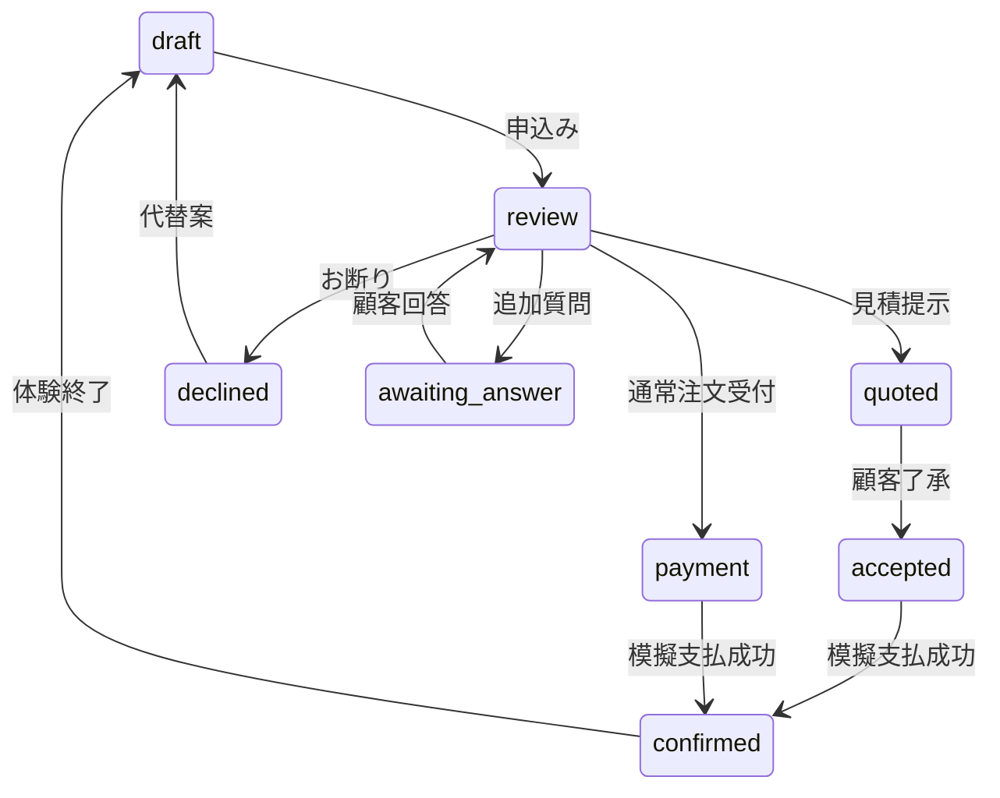

# SHINING food — PWA preview v2.0

公開先: https://shining-food-owner-demo.linkist39.chatgpt.site/
GitHub: https://github.com/linkist0622/shining-food （preview/pwa-v2ブランチ）

ユーザーの承認（2026-09-18）に基づき、コード・候補商品データ・写真・実装資料を公開リポジトリのpreview/pwa-v2ブランチで管理します。Sites側の作業原本と公開版にもコード・画像を保持しています。

本番の画面・操作を想定したプレビューです。実注文、Stripe API、カード入力、Wallet認証、LINE送信、施設への連絡はありません。顧客・店舗の入力はブラウザーのメモリーにのみ保持します。PWA先行。iOS/Androidのネイティブパッケージは未作成です。

## 起動

Node 22.13以上、pnpm（package.jsonのpackageManagerを参照）。

```bash
corepack enable
pnpm install --frozen-lockfile
pnpm dev
```

元のVinext / Cloudflare Workers構成、依存関係、ロックファイルを維持しています。環境別の詳細は [docs/STARTER.md](docs/STARTER.md)。Sites環境はSitesスキルのconfigure-execution-profileとsites-previewを使用します。

## 画面と操作

1. ロゴ・写真・コピーの約10秒のイントロ。開始時からスキップ可能。動きを減らす設定は約0.7秒。
2. 下部の「メニュー／BBQ予約／カート／注文状況／ご利用案内」で移動。
3. 商品、日時、受取方法、配送先、連絡先、本人受渡しを入力して申し込む。
4. 白い確認画面で「店舗側の確認へ進む」。店舗が受付・見積・追加確認・お断りを選ぶ。
5. 白い確認画面で「お客様の画面へ戻る」。見積があれば了承し、支払方法を選択する。
6. 模擬支払が成功したときのみ完了。通信断の間に処理が終われば失敗し、再接続後に再試行可能。
7. 「確認を終えてトップへ」で入力・カート・見積・回答・決済・役割・フィルターを消し、イントロへ戻る。相談継続中は自動消去しない。

## 構成・データ編集

| ファイル | 内容 |
|---|---|
| app/page.tsx | 顧客画面とプレビュー画面切替 |
| app/globals.css | 白・アイボリー・深緑・ゴールド、可変幅、固定バー |
| components/food/ | イントロ、共通入力、店舗確認、支払表示、PWA |
| lib/demo.ts | 既存の例示商品3件、BBQ、施設、検証、注文状態遷移 |
| lib/catalog.json | 候補16商品群＋24商品見出し。提供制約と参考価格 |
| lib/preview.ts | プレビュー専用の役割と消去処理 |
| public/images/ | 写真。catalog配下は供給元の商品群写真 |
| public/images/credits.json | 写真の由来 |
| public/sw.js / manifest.webmanifest / offline.html | PWA、静的なオフライン案内 |
| tests/demo.test.mjs | 必須6経路、ガード、候補・施設制約の検証 |
| app/qa/page.tsx | 開発時だけの390px/320px iframe。productionは404 |

候補40件の写真は16商品群の代表写真。子商品の正確な写真であると誤認させないため「商品群の参考写真」と表示します。正式価格は元台帳で全件空欄です。catalogの`price`は画面操作用の仮設定で、`officialPrice:null`を維持しています。原価、顧客情報、秘密鍵、社内資料原本は含めません。商品群と個別商品を合わせた40件は、40種類の正式SKUが決まった意味ではありません。

元資料: SHINING_food_Pricing_Master.xlsx と SHINING_food_Research_and_Proposals_v1.0_20260918.md（2026-09-18調査）。廃止7群は表示を残して注文追加を停止。実店舗専用版やデリバリー終了の商品を配達可能に変更しません。テイクアウトも許諾未確認のため店舗相談に進みます。比較調査だけの51ブランドや追加提案2ブランドを正式候補へ拡張していません。

F-001〜F-012はユーザー指示で全件表示。名称・所在地・実在施設との対応・許可は未照合。全件相談へ進みます。ホテル1130／スウィートグラス／浅間ハイランドパーク管理センターは別の操作例で、F番号との対応を推定していません。

配達料金はユーザーの暫定方針「5kmまで1000円／それ以上2000円／商品代10000円以上無料」を参考計算に反映しました。距離計算は未接続のため未判定は1000円を仮表示し、範囲外自己申告は2000円、10000円以上は0円。最終額は店舗確認・見積で調整します。商品代と送料の免除条件・距離の測り方は正式運用前に事業室で確定してください。

## 状態遷移



見積了承前・相談中・お断り状態は支払不可。商品・人数・住所・日時変更で見積／了承／支払選択を失効。処理中は二重開始を防止し、旧revisionの完了応答も無視します。支払失敗は注文確定にしません。

## PWAと本番化の境界

- manifest、192/512pxアイコン、maskableアイコン、standalone起動、safe-area、更新案内を実装。
- SWキャッシュはoffline.htmlと3つのアイコンのみ。住所、カート、見積、決済、API結果、アプリHTMLをキャッシュしません。注文データ用IndexedDBは作りません。
- 更新は操作が空の状態のみ許可。入力中は「操作を終えると更新できます」と表示。
- 公開はHTTPSですが、この作業のブラウザーQAはHTTPの開発環境です。iPhone/Androidの実端末へのインストール、サービスワーカー更新、実キーボード・安全領域、OSの動き軽減設定での確認は未実施。コード検査とブラウザー幅確認を区別しています。
- 本番で顧客がStorePanelに入れないよう、別管理画面・サーバー認証・権限・監査ログを実装する必要があります。PREVIEW_MODEをfalseにするだけで本番化は完了しません。
- このリセットはプレビュー専用。本番の注文履歴・店舗記録を削除するAPIと共用しません。

## 検証

```bash
node --experimental-strip-types tests/demo.test.mjs
pnpm exec tsc --noEmit
pnpm exec eslint app/page.tsx components/food lib/demo.ts lib/preview.ts --quiet
pnpm build
```

ブラウザー検証と残件は [docs/VERIFICATION.md](docs/VERIFICATION.md)、Stripe仕様は [docs/PAYMENTS.md](docs/PAYMENTS.md)、事業室への文案は [docs/HANDOFF.md](docs/HANDOFF.md) を参照。

## 公開更新と戻し方

GitHubのソース管理とSitesの公開は別です。編集後に型検査・状態遷移テスト・ビルドを行い、既存Site ID（.openai/hosting.json）を使って同じ公開先へ更新します。公開範囲は既存のpublicを維持。別Siteや別ホスティングを作りません。秘密鍵をリポジトリに保存しないでください。

変更を戻す場合は対象コミットをgit revertし、その状態を再ビルドして既存Siteへ公開します。Sites側で以前保存されたv0.2の版へ戻す場合も、公開履歴の版を確認して同じSiteへ再デプロイします。共有範囲は変更しません。
